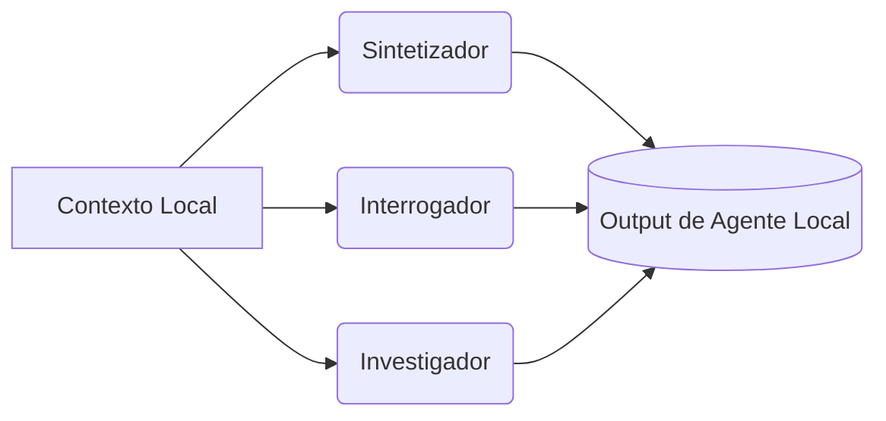

# 🤖 Agentes en NotebookUm (Global)

Este documento centraliza la arquitectura general de los agentes que operan en **NotebookUm**. Para evitar una definición monolítica y global, las responsabilidades y reglas específicas de cada agente se delegan a sus respectivos contextos en cada carpeta.

## Arquitectura Base

Se sigue un modelo de múltiples modelos de IA para optimizar la latencia y la profundidad analítica, compuesto por tres roles fundamentales:

1. **El Sintetizador (Gemma3-4b)**: Síntesis de información y resúmenes ejecutivos.
2. **El Interrogador (Nemotron-3-nano-30b)**: Generación de Q&A y detección de dudas y flujos alternos.
3. **El Investigador (GPT-OSS-20b)**: Análisis profundo, investigación técnica de arquitecturas y patrones.

## Agentes por Contexto

Cada módulo principal del repositorio define las instrucciones exactas y el comportamiento esperado para los agentes según sus necesidades:

- 📁 [**app/agents.md**](./app/agents.md): Reglas para el desarrollo del código, lógica de negocio y arquitectura (API, Base de datos, Tareas asíncronas).
- 📁 [**specs/agents.md**](./specs/agents.md): Reglas para la gestión y análisis de requerimientos, planes de desarrollo (plan.md, spec.md, tasks.md) y adherencia a la `constitution.md`.
- 📁 [**tests/agents.md**](./tests/agents.md): Reglas para el ciclo de pruebas guiadas por TDD, diseño de contratos y casos límite.

*Consulta el archivo `agents.md` de cada carpeta para entender cómo operan los agentes en esos directorios específicos y cómo aplican principios como TDD o PEP 8.*