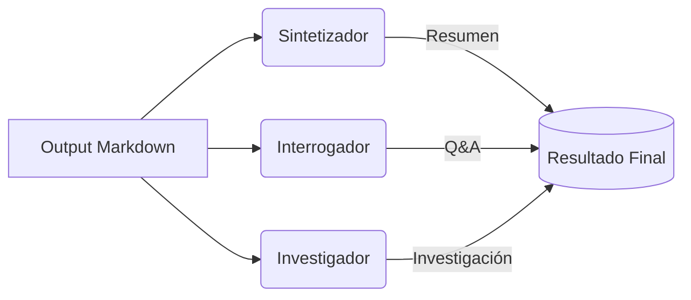

# 🤖 Definición de Agentes

Este documento describe el conjunto de agentes utilizados en NotebookUm. Se sigue una arquitectura de múltiples modelos para optimizar tanto la latencia como la profundidad analítica.

---

### 1. El Sintetizador (Gemma3-4b)
- **Objetivo:** Extraer ideas principales y realizar resúmenes ejecutivos.
- **Razón de elección:** Baja latencia y alta capacidad de síntesis en contextos cortos/medios.
- **Output:** Markdown con bullet points y conceptos clave.

### 2. El Interrogador (Nemotron-3-nano-30b)
- **Objetivo:** Generar secciones de preguntas y respuestas (Q&A) basadas en el contexto recuperado.
- **Razón de elección:** Excelente seguimiento de instrucciones y razonamiento lógico para detectar dudas potenciales del usuario.
- **Output:** Formato Pregunta/Respuesta con referencias al texto original.

### 3. El Investigador (GPT-OSS-20b)
- **Objetivo:** Realizar una investigación profunda, encontrar patrones complejos y sintetizar conclusiones técnicas.
- **Razón de elección:** Su tamaño permite un razonamiento más denso y una "investigación" interna más robusta sobre el contenido total del Markdown.
- **Output:** Reporte detallado de investigación.